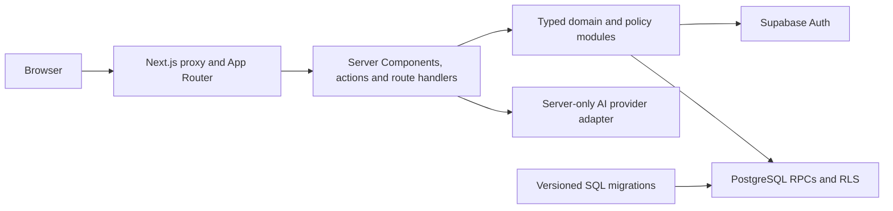

# PLAVE Project004

PLAVE is a Vietnamese-language mathematics learning platform developed as a
Final Year Project. It provides one Next.js application for Student, Parent and
Teacher journeys across Grades 1–9, together with a loopback-only Owner review
surface for inspecting generated curriculum candidates.

The project explores personalized practice and evidence-based progress while
keeping authorization, scoring, release visibility and experimental features
fail-closed. Automated software checks demonstrate implementation behavior;
they are not evidence of learning effectiveness or expert pedagogical approval.

## Current product truth

| Area | Current state |
|---|---|
| Grade 1 | Implemented and locally demonstrated through the public fixed-practice runtime. |
| Grades 2–9 | Candidate content and database-backed fixed-safe/adaptive paths are implemented and locally verified. Repository and canonical database release policy remain `HIDDEN`; public activation and deployment are not claimed. |
| XP | `PLAVE_SCORING_POLICY_V1`: correct `EASY` = 10 XP, `MEDIUM` = 15 XP, `HARD` = 20 XP; incorrect = 0 XP. Eligible persisted answers use an append-only, exactly-once ledger. |
| Learning activity | Completed `PRACTICE_FIXED`, `CURRICULUM` and `ADAPTIVE_PILOT` attempts use one exactly-once activity projection for goals, achievements and streaks. |
| Curriculum outcomes | Grade 1 skill evidence is available. A canonical published Grade 1 skill/question-to-outcome mapping has not been proven, so the UI does not fabricate curriculum-outcome evidence. |
| Vietnamese presentation | Known skill labels share one Vietnamese presentation layer across Student, Parent, Teacher and review surfaces. Missing canonical labels fail closed with a neutral message. |
| AI Tutor | The Google provider workflow is server-only and configuration-gated. Local configuration and offline contracts are verified; an authenticated live-provider browser round-trip is not claimed by the current repository evidence. |
| Email | Supabase authentication confirmation/recovery flows are implemented; real email delivery is provider-dependent and not proven here. |
| Redis, queues and workers | Not used. There is no Redis, BullMQ or background-worker service. |
| Deployment | Not deployed by this repository handoff. Local and CI evidence is not production deployment evidence. |

Tracked migrations are continuous from `0001` through `0047`. Preserved
Owner-authorized operational evidence records migrations `0045`, `0046` and
`0047` on the canonical schema, but this repository review does not reconnect
to or mutate that database. Grades 2–9 activation, publication, entitlement and
application deployment remain separate unexecuted gates.

## Users and product surfaces

- **Student:** registration, onboarding, lessons, diagnostic assessment,
  fixed/curriculum/adaptive practice, assignments, result/review, history,
  progress, XP, goals, achievements, streaks and the configuration-gated Tutor.
- **Parent:** student-request linking and progress for an accepted child
  connection only. Parent summaries distinguish skill evidence from mapped
  curriculum-outcome evidence.
- **Teacher:** invitation-gated onboarding, classrooms, question workshop,
  assignments, gradebook and analysis for owned classrooms and active members.
- **Reviewer/Owner:** development-only, loopback-only generated-content review.
  Reviewer is not a fourth public Supabase profile role and does not make hidden
  candidates public.

## Core learning behavior

- Grade 1 uses the fixed practice tables and runtime.
- Grades 2–9 use the universal curriculum runtime when the exact server and
  database release tuple authorizes access.
- Fixed-safe practice is used where the verified question pool cannot support
  an adaptive-mastery claim.
- Adaptive practice is entitlement- and release-gated and remains deny-all by
  default.
- Static, generated and on-demand curriculum submissions share persisted
  attempt/answer contracts; generated and on-demand modes remain flag-gated.
- Result and review loaders are owner-scoped and read-only on reopen.
- Answer retries, concurrent duplicates, reloads and result reopening do not
  duplicate XP or learning-activity events. A legitimate retake has a new
  attempt identity.
- Mastery labels are PLAVE product criteria, not official school assessments.

## Architecture

PLAVE is a single-package full-stack application. It does not contain a NestJS
backend, Prisma data layer, Redis queue or separate worker.



- **Frontend and application server:** Next.js 16.2.12, React 19.2.8 and
  TypeScript 5.9.3.
- **Persistence:** Supabase/PostgreSQL through versioned SQL migrations and
  typed runtime contracts.
- **Authentication:** Supabase SSR clients with HTTP-only session cookies.
  Proxy refresh improves navigation, while page/server checks and RLS/RPC
  ownership remain the authorization boundary.
- **Mutations:** server routes/actions validate payloads; database functions
  provide transactional and idempotent writes where multiple projections must
  agree.
- **Private solutions:** correct answers and solution material remain behind
  post-submit/server authorization boundaries.
- **Runtime flags:** Grades 2–9, adaptive, generated content and AI availability
  are controlled by server-side configuration and database policy, never a
  browser-provided role or entitlement.

## Repository structure

| Path | Responsibility |
|---|---|
| `app/` | App Router pages, server actions and API route handlers. |
| `components/` | Shared Vietnamese user-interface components. |
| `lib/` | Authentication, curriculum, scoring, activity, role and security contracts. |
| `supabase/migrations/` | Ordered PostgreSQL schema, RLS, grants, functions and release contracts. |
| `supabase/operations/` | Guarded operator packages; not part of quick start. |
| `content/` and `data/` | Versioned curriculum candidates, release artifacts and fixtures. |
| `scripts/` | Local launchers, deterministic generators, audits and controlled operator tools. |
| `tests/` | Node test-runner unit, contract, integration and security tests. |
| `docs/` | Architecture history, runbooks, limitations and immutable checkpoint evidence. |
| `.github/workflows/` | Exact-head Grades 1–9 quality gate. |
| `Dockerfile` and `compose.yaml` | Application-only container build and loopback local-demo delivery. |

## Prerequisites

- Node.js **22.16.0**, matching the canonical CI workflow.
- npm and the committed `package-lock.json` (the npm version is not pinned in
  repository metadata).
- Git.
- An approved Supabase project or disposable local Supabase/PostgreSQL instance
  for authenticated persistence flows.
- Docker and Supabase CLI only for explicitly documented disposable database
  proofs; they are not required for static tests or public source review.
- Docker Engine/Desktop with Compose v2 for the optional application-only
  container workflow.

Do not install or upgrade dependencies to reproduce the verified dependency
graph. Use the lockfile:

```bash
npm ci --ignore-scripts --no-audit --no-fund
```

## Environment configuration

`.env.example` is a names-only template. Copying it does not create a working
authenticated environment because its public values are placeholders.

| Variable | Boundary | Purpose |
|---|---|---|
| `NEXT_PUBLIC_SUPABASE_URL` | Browser-safe public configuration | Supabase API origin. |
| `NEXT_PUBLIC_SUPABASE_PUBLISHABLE_KEY` | Browser-safe public configuration | Supabase publishable key; authorization still depends on RLS. |
| `PLAVE_PROJECT004_REMOTE_RUNTIME_MODE` | Server-only runtime file | Selects the validated runtime class. |
| `PLAVE_PROJECT004_REMOTE_TARGET_NAME` | Server-only runtime file | Binds the approved Project004 target. |
| `PLAVE_PROJECT004_REMOTE_PROJECT_REF` | Server-only runtime file | Guards project identity. |
| `PLAVE_CURRICULUM_RUNTIME_ENABLED` | Server-only | Enables the universal runtime only when database release policy also permits it. |
| `PLAVE_GRADES_2_9_RELEASE_MODE` | Server-only | `HIDDEN`, controlled `PILOT`, or explicitly authorized `PUBLIC`. |
| `PLAVE_ADAPTIVE_PRACTICE_RUNTIME_ENABLED` | Server-only | Adaptive runtime gate. |
| `PLAVE_CONTROLLED_PILOT_ENABLED` | Server-only | Controlled-pilot gate. |
| `PLAVE_ADAPTIVE_PILOT_ENTITLEMENTS` | Server-only | Exact signed/typed pilot entitlement set; empty is deny-all. |
| `PLAVE_AI_TUTOR_ENABLED` | Server-only | Enables Tutor only with a valid provider contract. |
| `PLAVE_AI_PROVIDER` | Server-only | Provider selection; the canonical Owner launcher requires Google. |
| `GOOGLE_API_KEY` | Secret, server-only | Google provider credential. Never prefix with `NEXT_PUBLIC_`. |
| `GOOGLE_AI_MODEL` | Server-only | Model allowed by the application contract. |
| `PLAVE_AI_*` limit variables | Server-only, optional | Input, history, output, rate and timeout bounds. |

Never commit `.env.local`, `.env.remote-dev.local`, database credentials,
browser profiles or runtime artifacts. Protected configuration files must be
regular, non-symlink, current-user-owned files with mode `0600`.

## Local setup

### 1. Clone and install

```bash
git clone https://github.com/HaNguyenQuocTrung/PLAVE-PROJECT004.git
cd PLAVE-PROJECT004
npm ci --ignore-scripts --no-audit --no-fund
```

### 2. Prepare development configuration

```bash
cp .env.example .env.local
chmod 600 .env.local
```

Replace only the required placeholder values with configuration for an
approved development or disposable project. Keep all hidden/pilot/provider
flags disabled unless the relevant runbook explicitly authorizes them. The file
is ignored by Git.

### 3. Development mode

```bash
npm run dev
```

This is the standard Next.js development server. Authenticated/database-backed
journeys require a compatible schema and valid public Supabase settings.

### 4. Production-local build

```bash
npm run build:production-local
```

The launcher builds in a disposable workspace, excludes `.env*`, and promotes
the artifact atomically. It accepts either the guarded runtime file or an
explicit paired public Supabase environment. The build does not receive an AI
provider key.

### 5. Canonical production-local start

The complete Owner localhost workflow is documented in
[`docs/operations/AI_TUTOR_OWNER_SETUP.md`](docs/operations/AI_TUTOR_OWNER_SETUP.md).
Its interactive configuration commands write protected local files and do not
belong in CI. After both Supabase runtime and Google server configuration pass
preflight:

```bash
npm run start
```

The command rebuilds and starts the complete application on
`http://127.0.0.1:3000` (also reachable as `http://localhost:3000`). It fails
before opening a listener when required
configuration is missing or invalid; it does not silently advertise a disabled
Tutor edition. The URL printed by `npm run start` is authoritative if an
explicit port override is used.

### Optional isolated demonstration environment

The repository also retains a managed, disposable demonstration workflow for
authorized local operator acceptance. It is separate from the canonical
production-local start, uses `http://127.0.0.1:3100`, and may require already
installed local Docker/Supabase tooling:

```bash
npm run owner-local-demo:preflight
npm run owner-local-demo:start
npm run owner-local-demo:stop
```

Follow
[`docs/operations/OWNER_LOCAL_DEMO_RUNBOOK.md`](docs/operations/OWNER_LOCAL_DEMO_RUNBOOK.md)
before using this workflow. It creates disposable state and must not be treated
as a deployed environment. No public demonstration video is currently available.

### Application-only Docker delivery

The Docker workflow packages only the Next.js application. It does not run or
replace Supabase/PostgreSQL, apply migrations, seed content, activate releases
or contact AI/email providers. Compose binds `127.0.0.1:3100` and leaves the
canonical host port 3000 untouched.

```bash
cp .env.docker.example .env.docker.local
chmod 600 .env.docker.local
npm run docker:verify
npm run docker:build
npm run docker:compose:up
```

The `NEXT_PUBLIC_SUPABASE_*` pair is public build-time configuration in Next.js;
rebuild the image when that intended public target changes. Private database,
service-role and provider credentials must not be added to the build or Compose
file. See [`docs/DOCKER.md`](docs/DOCKER.md) for health, logs, cleanup,
hardening and troubleshooting details. No image has been pushed to a registry.

## Database and migrations

The canonical tracked migration range is `0001`–`0047`. Check continuity and
static contracts without connecting to a database:

```bash
node --no-warnings --experimental-strip-types scripts/run-ci-quality-test-group.ts migration-inventory
```

Disposable PostgreSQL proofs are isolated operator workflows. Never apply a
remote migration from the quick start. A remote apply requires explicit Owner
authorization, exact project/ledger/hash preflight, a fresh logical backup,
disposable restore proof and post-apply verification. Release activation,
content publication, entitlement and application deployment are separate
operations.

## Testing and quality

Common local checks:

```bash
npm run typecheck
./node_modules/.bin/tsc --noEmit --project tsconfig.secret-boundary.json
npm run lint
npm run security:secret-boundary
npm run test:unified-xp
npm run test:unified-activity
npm run test:universal-curriculum
npm run test:universal-collaboration
npm run test:curriculum-1-9
npm run test:adaptive-curriculum
npm run test:final-local-acceptance
npm run docker:verify
```

Whole-repository verification:

```bash
npm_config_offline=true npm run --silent test:full:official
npm run build:production-local
npm run verify:production-route-manifest
npm run build:final-local-acceptance
npm run test:final-local-acceptance
git diff --check
```

The full harness uses a restricted child environment and makes no provider or
remote-database call. Some loopback/Docker tests can be classified as explicit
environment exclusions inside a restricted sandbox; they are not product
passes. The unrestricted exact-head GitHub Actions workflow is the terminal
whole-project result.

Historical test/page/sample counts live in commit-bound receipts and status
documents. This README intentionally does not present them as timeless current
totals.

## Security and privacy

- User data is owner/role scoped in server contracts and PostgreSQL RLS/RPCs.
- A Parent can read progress only through an accepted child connection.
- A Teacher can read classroom data only for owned classrooms and valid active
  memberships.
- Student attempts, reviews and history are owner-scoped; direct URLs do not
  grant access.
- Security-definer functions use reviewed ownership, grants and safe search
  paths; the browser never receives a service-role credential.
- Provider secrets remain server-only and are excluded from client artifacts,
  logs, Git and deterministic receipts.
- Do not place production PII, UUIDs, cookies, tokens, answers or private
  solutions in issues, screenshots or test output.
- Security headers deny framing and object embedding and set referrer,
  permissions and MIME-sniffing policy. Authentication and Tutor endpoints
  retain fail-closed validation, timeout and rate-limit behavior.

No separate responsible-disclosure address is defined in the repository.
Report a private security concern to the repository owner through an agreed
private channel; do not open a public issue containing sensitive evidence.

## Deployment status

**Locally demonstrated and configured, not deployed.**

There is no verified public application URL in this repository. Canonical
schema readiness and local `PUBLIC` acceptance do not mean Grades 2–9 are
activated, published or available online.

## Known limitations

- Grade 1 has no proven canonical published curriculum-outcome mapping. Skill
  evidence must not be relabeled as official GDPT outcome evidence.
- Grades 2–9 remain hidden/not activated by default despite local runtime and
  disposable database acceptance.
- Automated source, oracle, runtime and browser checks are software evidence,
  not expert pedagogical validation or learning-effectiveness research.
- AI Tutor is provider-dependent; current tracked evidence does not claim an
  authenticated live-provider browser round-trip.
- Real authentication email delivery and provider availability depend on the
  configured Supabase environment.
- Browser usability observations and automated tests are separate evidence
  classes; one must not be used to fabricate the other.
- Some historical reports describe earlier migration ranges or release states.
  They are retained as explicitly historical checkpoints; use this README and
  [`docs/final/PLAVE_RELEASE_READINESS.md`](docs/final/PLAVE_RELEASE_READINESS.md)
  for the current handoff.

## Academic context

PLAVE Project004 is a Final Year Project by Ha Nguyen Quoc Trung. The repository
demonstrates software architecture, authorization, deterministic verification
and guarded learning workflows. It does not claim Ministry endorsement, school
certification, expert curriculum review or measured improvement in student
learning outcomes.

## License and contributions

No `LICENSE` file is currently included. The repository must not be assumed to
be open source or reusable beyond applicable law and explicit permission from
the owner. External contributions are not currently solicited; no contribution
workflow or contributor license agreement is defined.

## Evidence freshness

- **Last repository review:** 2026-08-15
- **Baseline entering this review:** `099b0b8050dd1c33348c2df1350466c260ed04ce`
- **Last verified source/content handoff commit:**
  `5ccf1fac7a6e63af00b3faaa78fc79680c42bb26` — exact-head quality gate
  [31868865536](https://github.com/HaNguyenQuocTrung/PLAVE-PROJECT004/actions/runs/31868865536)
  succeeded.
- **Canonical workflow:** `.github/workflows/plave-quality-gate.yml`
- **Deterministic evidence:** `content/releases/grades-1-9/`

Because a commit cannot embed its own hash without changing that hash, this
field records the CI-green source/content handoff commit. A later metadata and
receipt-only commit is reported separately in Git history and CI.
